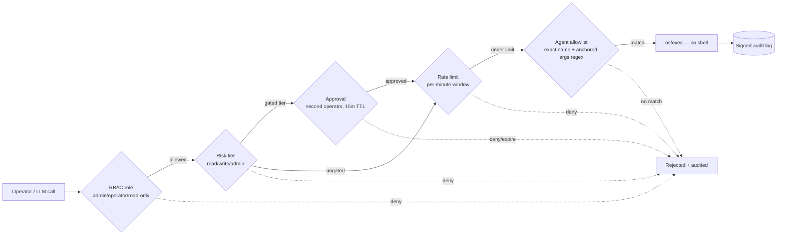

# The Golden Path: getting real value from Myrmex Hive

This guide answers the two questions every new operator asks:

1. **What can the agents actually do to my hosts?** Can they *change* things —
   stop a service, run a command — or only look?
2. **What's the fastest safe route from "installed" to "this is saving me
   work"?**

It is a mental model and a progression, not a command reference. For install,
config fields, and the full CLI, the
[README](https://github.com/olafkfreund/myrmex-hive#readme) is the single
source — this page links to it rather than repeating (and drifting from) it.

---

## 1. What an agent can and cannot do

An agent exposes a small, fixed set of tools. Every one of them is either
**read-only** or **routes through the command allowlist** — there is no
general "run anything" and no arbitrary file write.

| Tool | Effect | Changes the host? |
|---|---|---|
| `get_metrics` | CPU / memory / disk sample (plus recent trend history when the Gateway is polling) | No |
| `get_system_info` | OS, kernel, uptime, hostname | No |
| `read_logs` | Tail a log file (bounded) | No |
| `file_read` | Read one file (absolute path, no `..`, size-capped) | No |
| `container_ps` | `docker ps` | No |
| `k8s_get` | `kubectl get …` | No |
| `package_query` | Query installed packages (dpkg/rpm/apk/pacman/dnf) | No |
| `service_control` | `systemctl start\|stop\|restart\|status <svc>` | **Yes** |
| `run_command` | Run an **allowlisted** command with matching args | **Yes, if allowlisted** |

So the honest answer to *"can we write to the host and stop/start services?"*:

- **Change service state — yes.** `service_control` and an allowlisted
  `systemctl`/`docker` command can start, stop, and restart services.
- **Run commands that make changes — yes, but only the exact ones you
  allowlist.** If your allowlist permits `nginx -s reload` or a deploy script,
  the agent can run it. If it doesn't, the call is refused.
- **Write arbitrary files — no.** There is no `file_write` tool. `file_read`
  is read-only. To change a file you allowlist a command that does it (e.g. a
  specific config-reload or templating script), you don't hand the agent a
  filesystem.

This is deliberate. The agent's power is exactly the union of the commands you
allowlist — nothing wider. You grow capability by widening the allowlist, one
reviewed entry at a time.

---

## 2. Why "yes, it changes hosts" is still safe: the six gates

Every state-changing call passes through an independent funnel. A call has to
clear **all** of these, and each one fails closed.



1. **RBAC** — the bearer token maps to a role (`admin` / `operator` /
   `read-only`); the role's capability matrix decides whether the call is even
   allowed to be attempted.
2. **Risk tier** — each tool has a tier (`read`/`write`/`admin`). Your
   `RiskTiers` config overrides per tool; built-in **mutating** tools
   (`service_control`, `run_command`) default to a non-`read` tier so they
   can't slip past gating just because nobody classified them, and a
   genuinely unknown tool still defaults to `read`. Tiering only *acts* when
   `RequireApprovalTiers`/rate limits are set, so this stays
   backward-compatible.
3. **Approval** — tiers listed in `RequireApprovalTiers` become *pending
   approvals*: a second operator must approve within a 15-minute TTL before the
   call runs. This is your "two people to stop prod nginx" control. A new
   pending approval also **pages your configured alert targets**, so a
   legitimate mutation can't quietly expire because nobody was watching the
   portal.
4. **Rate limit** — `RateLimitPerMinute` caps calls in a sliding 60-second
   window, so a runaway loop (or a hijacked LLM) can't hammer the fleet.
5. **Allowlist** — on the agent itself, the command name must match an
   allowlist entry exactly and the joined arguments must match that entry's
   **anchored** `args_regex`. Execution is `os/exec` directly — **never a
   shell** — so there is no shell-expansion or injection surface.
6. **Signed audit log** — every action (allowed *and* rejected) is recorded and
   cryptographically signed with the gateway's host key. `myrmex audit verify`
   proves the chain is untampered.

The important consequence: the default example allowlist ships
`systemctl` restricted to `^(status|restart) (nginx|docker|sshd)$`. Even though
`service_control` accepts `stop`, a `stop` call is **refused by the allowlist**
until you add it. The tool enum and the allowlist regex both have to agree.
Capability is something you grant on purpose, never a default.

---

## 3. The golden path: from installed to indispensable

Walk these stages in order. Each one earns trust before you widen capability.

### Stage 0 — Enroll an agent (day 0)

Get one agent dialing home. Use the token-based enrollment flow
([Agent enrollment](ENROLLMENT.md)); the agent connects *out* to
`gateway:2222` and shows up in the fleet. Verify:

```bash
myrmex agents --token "$MYRMEX_TOKEN"
```

You should see the agent `connected`. Nothing on the target is listening — that
is the whole point.

### Stage 1 — Read-only value first (day 1)

Before you grant any mutation, get value from the read tools. This is where
Myrmex pays for itself with zero risk:

```bash
# Direct tool call — deterministic, no LLM
myrmex call agent-nginx__get_metrics --token "$MYRMEX_TOKEN"

# Natural-language, LLM-orchestrated — the product's core loop
myrmex ask "Is agent-nginx healthy? Check CPU, memory, disk and recent errors." \
  --token "$MYRMEX_TOKEN"
```

`ask` is the golden feature: the gateway's local LLM picks read tools, calls
them over the tunnel, and summarizes. Fleet-wide health triage in one sentence,
no shell, no exposed ports.

### Stage 2 — Controlled mutation (day 2)

Now grant *one* safe action. Add exactly what you need to the agent allowlist —
start with `restart`, not `stop`:

```jsonc
// agent_config.json — allowed_commands
{ "name": "systemctl", "args_regex": "^(status|restart) (nginx|docker)$" }
```

Then put `service_control` behind approval on the gateway so a mutation needs a
second human:

```jsonc
// gateway_config.json
"risk_tiers": { "service_control": "write" },
"require_approval_tiers": ["write", "admin"],
"rate_limit_per_minute": 30
```

Now a restart is a two-step, fully-audited action:

```bash
myrmex call agent-nginx__service_control \
  --arguments '{"action":"restart","service":"nginx"}' --token "$MYRMEX_TOKEN"
# -> queued as a pending approval

myrmex approvals            # a second operator reviews and approves
```

### Stage 3 — Let the LLM drive remediation (day N)

Once read tools and a couple of reviewed mutations are trusted, hand the LLM a
goal instead of a command. **Preview it first with `--plan`** — the model is
consulted at every step but nothing is executed; the response lists the tool
calls it *would* have made:

```bash
myrmex ask --plan "nginx on agent-nginx looks unhealthy — check it and restart it if the logs show it's wedged" \
  --token "$MYRMEX_TOKEN"
```

Happy with the plan? Drop `--plan` to let it act:

```bash
myrmex ask "nginx on agent-nginx looks unhealthy — check it and restart it if the logs show it's wedged" \
  --token "$MYRMEX_TOKEN"
```

The orchestration loop is **bounded** (a small fixed step budget, default 3),
**gated** (it can only call tools the agent actually advertises — it cannot
invent one), and **injection-hardened** (tool output is wrapped in
untrusted-data markers so a malicious log line can't hijack the model). Any
mutation it chooses still passes all six gates above, including approval. The
LLM proposes; the funnel disposes.

> **This is the payoff.** You describe intent in English; a local model triages
> across the fleet and proposes the fix; your policy decides whether it runs.
> No agent ever accepted an inbound connection to make it happen.

### Stage 4 — Scale it across the fleet and let it run itself

**One prompt, many agents.** Fleet mode runs the same bounded orchestration
against every selected agent and aggregates the summaries — "how's the whole
fleet doing?" in one call:

```bash
myrmex ask --all "Report disk usage and flag anything over 85%" --token "$MYRMEX_TOKEN"
```

Use `--agents a,b` to target a subset, and add `--plan` to preview a fleet-wide
action before it runs. Each agent gets the exact same six-gate treatment; fleet
mode is just the single-agent loop in a loop. (Equivalent under the hood to
calling the `gateway__ask_gemma` tool with `all_agents`/`agent_ids`.)

**Unattended health checks.** `scheduled_tasks` in the Gateway config run an
orchestration prompt on a timer and route the summary through your alert
targets — so the LLM works for you between shifts:

```jsonc
// gateway_config.json
"scheduled_tasks": [
  { "name": "nightly-disk-check", "agent_id": "agent-nginx",
    "prompt": "Report disk usage and flag anything over 85%", "interval_seconds": 3600 }
]
```

Empty/unset = off. `interval_seconds` only — no cron expressions.

---

## 4. Ways to reach the gateway

Pick the surface that fits the caller — they all hit the same gated core:

| You are… | Use |
|---|---|
| A human at a terminal | `myrmex` CLI (`status`, `agents`, `call`, `ask`, `audit`) |
| A human who wants a dashboard | The web portal at `https://gateway:8080/` (fleet, tools, approvals) |
| An MCP client (Claude Desktop, IDE) | MCP over stdio or SSE — every agent tool appears as `<agentID>__<tool>` |
| A script / automation | REST: `/api/status`, `/api/call`, `/api/chat`, `/api/tools` |

---

## 5. Widening capability safely — the rules of thumb

- **Allowlist the narrowest thing that works.** `nginx -s reload`, not
  `nginx`. `restart nginx`, not `systemctl .*`. The anchored regex is your
  contract; keep it tight.
- **Never allowlist a shell.** `bash`, `sh`, `ssh`, `env` defeat the whole
  model. Allowlist the specific end command instead.
- **Put every `write`/`admin` tier behind approval** in anything resembling
  production. The 15-minute TTL means stale approvals can't be replayed later.
- **Turn on rate limiting** before you let the LLM drive mutations — it's the
  backstop against a bad loop.
- **Watch the audit log.** `myrmex audit watch … || page-oncall` turns the
  signed log into a live tripwire.

---

## See also

- [Agent enrollment](ENROLLMENT.md) — get agents connected and rotate/revoke keys
- [Observability](OBSERVABILITY.md) — metrics, alerts, tracing
- [Compliance & audit](COMPLIANCE.md) — verify the signed audit log
- [README §6](https://github.com/olafkfreund/myrmex-hive#6-real-life-orchestration-scenarios) — worked orchestration scenarios
