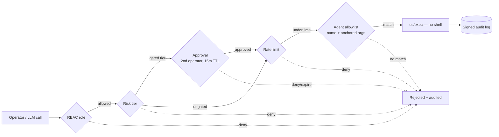

## The Golden Path

Two questions every new operator asks — answered honestly, then a staged route
from *installed* to *indispensable*.

> **Can the agents change my hosts, or only look?** They can start, stop, and
> restart services and run **allowlisted** commands — but there is **no
> arbitrary file write**, and every mutation clears six independent gates, each
> failing closed. Capability is something you grant on purpose, never a default.

This page is the visual tour. The full reference — every config field, the
allowlist rules, the tuning knobs — lives in the
[canonical Golden Path guide](https://github.com/olafkfreund/myrmex-hive/blob/main/docs/GOLDEN_PATH.md).

---

### What an agent can and cannot do

Every tool is either read-only or routes through the command allowlist. There is
no general "run anything."

| Tool | Effect | Changes the host? |
|---|---|---|
| `get_metrics` | CPU / memory / disk (plus recent trend) | No |
| `get_system_info` | OS, kernel, uptime, hostname | No |
| `read_logs` / `file_read` | Read a log / one file (bounded, no traversal) | No |
| `container_ps` / `k8s_get` | `docker ps` / `kubectl get …` | No |
| `package_query` | Query installed packages | No |
| `service_control` | `systemctl start\|stop\|restart\|status` | **Yes** |
| `run_command` | Run an **allowlisted** command with matching args | **Yes, if allowlisted** |

The default allowlist ships `systemctl` restricted to `status|restart` on
`nginx|docker|sshd` — so even a `stop` is refused until you add it. The tool and
the allowlist both have to agree.

---

### Why "yes, it changes hosts" is still safe

Every state-changing call passes through a funnel. It must clear **all six**, and
each fails closed.



1. **RBAC** — bearer token → role (`admin` / `operator` / `read-only`).
2. **Risk tier** — built-in mutating tools default to a non-`read` tier so they
   can't slip past gating unclassified.
3. **Approval** — gated tiers wait for a second operator, and a pending approval
   **pages your alert targets** so it can't silently expire.
4. **Rate limit** — a sliding per-minute window; the backstop against a runaway
   loop or a hijacked model.
5. **Allowlist** — exact command name + anchored args regex, executed via
   `os/exec` directly — **never a shell**.
6. **Signed audit log** — every action, allowed *and* rejected, cryptographically
   signed with the Gateway's host key.

---

### The staged path: from installed to indispensable

<b>Stage 0 — Enroll.</b> One agent dials *out* to the Gateway. Nothing on the
target listens. `myrmex agents` shows it `connected`.

<b>Stage 1 — Read-only value first.</b> Get triage with zero risk:

```bash
myrmex ask "Is agent-nginx healthy? Check CPU, memory, disk and recent errors."
```

The local LLM picks read tools, calls them over the tunnel, and summarizes.

<b>Stage 2 — One controlled mutation.</b> Allowlist a single safe action
(`restart`, not `stop`), put it behind approval, and now a restart is a
two-person, fully-audited event that pages on-call.

<b>Stage 3 — Preview, then let it act.</b> Build trust with a dry run — the model
runs the whole loop but executes nothing:

```bash
myrmex ask --plan "Restart nginx on agent-nginx if the logs show it's wedged"
```

Happy with the plan? Drop `--plan`.

<b>Stage 4 — Scale out and let it run itself.</b> One prompt across the fleet
(`--agents a,b` for a subset, `--plan` to preview):

```bash
myrmex ask --all "Report disk usage and flag anything over 85%"
```

…and unattended health checks on a timer, routed to your alerts:

```json
"scheduled_tasks": [
  { "name": "nightly-disk-check", "agent_id": "agent-nginx",
    "prompt": "Report disk usage and flag anything over 85%", "interval_seconds": 3600 }
]
```

> **The payoff.** You describe intent in English; a local model triages across
> the fleet and proposes the fix; your policy decides whether it runs. No agent
> ever accepted an inbound connection to make it happen.

---

Ready for the details? The
[full guide](https://github.com/olafkfreund/myrmex-hive/blob/main/docs/GOLDEN_PATH.md)
covers the config fields, allowlist tuning, and the rules of thumb for widening
capability safely. Install steps are in the
[README](https://github.com/olafkfreund/myrmex-hive#readme).
