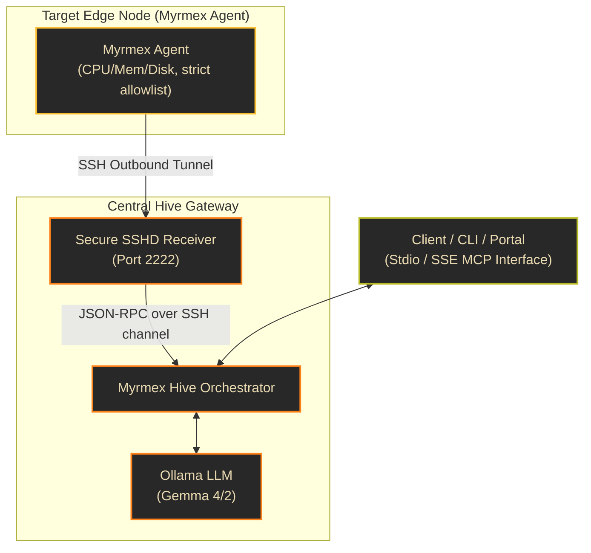

## Welcome to Myrmex Hive

Myrmex Hive is a decentralized, secure, and geeky agent orchestration framework built on top of the **Model Context Protocol (MCP)**. It is designed to securely monitor, query, and manage distributed edge servers, Docker hosts, and Kubernetes nodes without exposing any ingress ports on your target systems.

> **New here?** [**What it's for →**]({{ '/use-cases/' | relative_url }}) — eight
> concrete use cases, from chaos-testing your own service to airgapped fleet
> triage, plus an honest list of what it deliberately is *not*.
> Then walk the [**Golden Path**]({{ '/golden-path/' | relative_url }}).

---

### 1. Architecture & Security Model

Myrmex Hive is built for zero-trust environments where target edge systems (agents) must remain completely isolated from direct inbound network traffic.



#### Security Principles (Why We Made These Choices)
* **Zero Inbound Ports**: Instead of running an SSH daemon or exposing management ports (like HTTP/gRPC) on your target servers, the **Myrmex Agent** initiates a secure, outbound connection to the **Myrmex Gateway**. This eliminates the primary attack vector of public scanner discovery and automated brute-force attacks.
* **OS-Grade Encryption**: Outbound tunnels utilize standard SSH protocol channels managed via Go's native `crypto/ssh` package, enforcing secure Ed25519 signature validation and high-grade ciphers (ChaCha20-Poly1305, AES-GCM).
* **Defense-in-Depth Allowlist**: The Agent executes binaries directly via OS process forks (`os/exec`) rather than invoking a shell (like `/bin/sh` or `bash`). This completely bypasses shell expansion, neutralizing shell injection vulnerabilities. Arguments are strictly validated against developer-defined regular expressions in `config.json`.
* **Central Token Authorization**: Access to the Gateway's control API is guarded via secure bearer token authentication.

---

### 2. Multi-Platform Installation Guide

Myrmex Hive supports Go, Nix, Linux, macOS, and Windows environments.

#### Nix / NixOS (Declarative Flake)
Add Myrmex Hive to your `flake.nix` inputs:
```nix
inputs.myrmex-hive.url = "github:olafkfreund/myrmex-hive";
```

You can then run the CLI tool directly:
```bash
nix run github:olafkfreund/myrmex-hive#myrmex -- --help
```

To deploy a Myrmex Agent or Gateway as a declarative systemd service on NixOS, enable the module in your `configuration.nix`:
```nix
{ inputs, config, pkgs, ... }: {
  imports = [ inputs.myrmex-hive.nixosModules.default ];

  services.myrmex-hive = {
    enable = true;
    role = "agent"; # Or "gateway"
    configPath = "/etc/myrmex/agent_config.json";
  };
}
```

#### Linux & macOS (Direct Install)
To download, compile, and configure the Agent as a background daemon (systemd on Linux, LaunchDaemon on macOS):
```bash
sudo ./install.sh
```
*The installer automatically compiles the agent binary, generates secure Ed25519 keys, writes the `config.json`, and boots the service.*

#### Windows (PowerShell Script)
To install the Agent on Windows Server or Windows 10/11, launch PowerShell as **Administrator** and run:
```powershell
Set-ExecutionPolicy Bypass -Scope Process -Force
.\install.ps1
```
*The PowerShell script compiles the binary, registers the agent configuration under `C:\ProgramData\mcp-agent\`, generates OpenSSH keys, and schedules a background task to launch the agent at system startup.*

---

### 3. Configuration Setup

#### Agent Configuration (`agent_config.json`)
Allows you to define a single gateway or a list of multiple gateway addresses for High Availability (HA) failover cycling:
```json
{
  "agent_id": "agent-nginx",
  "gateway_addr": "gateway-1.internal:2222",
  "gateway_addrs": [
    "gateway-1.internal:2222",
    "gateway-2.internal:2222"
  ],
  "private_key_path": "/etc/mcp-agent/id_ed25519",
  "allowed_commands": [
    {
      "name": "uptime",
      "args_regex": "^$"
    },
    {
      "name": "systemctl",
      "args_regex": "^(status|restart) (nginx|postgresql)$"
    }
  ]
}
```

#### Gateway Configuration (`gateway_config.json`)
Configures the receiver, TLS certs, OIDC/Tokens RBAC role mapping (`admin`, `operator`, `read-only`), and signed audit log path:
```json
{
  "listen_addr": ":2222",
  "http_addr": ":8080",
  "host_key_path": "",
  "authorized_keys_path": "authorized_keys",
  "ollama_url": "http://localhost:11434",
  "ollama_model": "gemma4:e4b",
  "auth_token": "fallback_admin_token",
  "tokens": {
    "admin-token-123": "admin",
    "operator-token-456": "operator",
    "read-token-789": "read-only"
  },
  "audit_log_path": "audit.log"
}
```
*Note: If `audit_log_path` is set, Myrmex Gateway records all `/api/call` and `/api/chat` executions alongside a cryptographic signature generated using the Gateway's private SSH host key.*

---

### 4. Local LLM Setup (Ollama & Gemma 4)

Myrmex Hive orchestrates actions and interprets output using local LLMs.

#### Option A: Running as Docker Side-Services (Recommended)
An optional Docker setup is available via profiles in `docker-compose.test.yml` preloaded with the `gemma4:e4b` model (offline-ready):

* **CPU-only mode**:
  ```bash
  docker compose --profile ollama-cpu up -d
  ```
* **GPU-accelerated mode** (requires NVIDIA Container Toolkit):
  ```bash
  docker compose --profile ollama-gpu up -d
  ```

#### Option B: Manual Host Setup
1. Install [Ollama](https://ollama.com/) on your Gateway server.
2. Pull the desired model (Gemma 4):
   ```bash
   ollama pull gemma4:e4b
   ```
3. Ensure Ollama is running and accessible (default `http://localhost:11434`). Link it in `gateway_config.json`.

---

### 5. Using the Myrmex CLI (`myrmex`)

The Go-based Myrmex CLI allows operators to interact with the gateway, view agents, invoke tools, and launch the assistant directly from the terminal.

#### Global Options
* `--url`: Gateway API base URL (default: `https://localhost:8080`)
* `--token`: Gateway token (or `MYRMEX_TOKEN` environment variable)
* `-o`, `--output`: Output format (`text` or `json`)

#### CLI Command Reference
* **Status**: View connected edge agents and configured upstream servers:
  ```bash
  myrmex status
  ```
* **Agents**: List detailed specifications of all connected agents:
  ```bash
  myrmex agents
  ```
* **Tools**: List all available tools across the swarm:
  ```bash
  myrmex tools
  ```
* **Call**: Execute a tool on a specific agent. Automatically unmasks and un-escapes payloads:
  ```bash
  myrmex call agent-nginx__get_metrics
  ```
* **Call with JSON output**: Outputs a clean, raw JSON payload directly to stdout (perfect for piping to `jq`):
  ```bash
  myrmex call agent-nginx__get_metrics -o json | jq '.cpu_usage_percent'
  ```
* **Ask**: Prompt the Myrmex AI assistant to analyze and perform actions. Terminal output is beautifully styled in monospace markdown:
  ```bash
  myrmex ask "Is nginx running on agent-nginx? If not, restart it."
  ```
* **Ask with JSON output**: Forward the final AI response directly to other automated tools or agents:
  ```bash
  myrmex ask "Check system metrics" -o json
  ```
* **Ask in plan (dry-run) mode**: Preview what the assistant *would* do — the model runs the loop but executes no tools:
  ```bash
  myrmex ask --plan "Restart nginx on agent-nginx if it looks wedged"
  ```
* **Fleet-wide orchestration**: One prompt across many agents, summaries aggregated. `--all` for the whole fleet, `--agents a,b` for a subset:
  ```bash
  myrmex ask --all "Report disk usage and flag anything over 85%"
  ```

New to Myrmex? Start with the **[Golden Path]({{ '/golden-path/' | relative_url }})** — what agents can do to your hosts, the six safety gates, and a staged rollout from read-only to LLM-driven remediation.

---

### 6. Real-Life Orchestration Scenarios

#### Scenario A: Automated Cluster Recovery
An operator issues a query:
`myrmex ask "Check load average on agent-db. If it's over 4.0, run diagnostic logs and let me know what process is consuming CPU."`
1. The orchestrator calls `agent-db__get_metrics`.
2. The orchestrator parses the returned metrics JSON.
3. If the load is over `4.0`, the local Gemma model identifies that `agent-db__run_command` with argument `{"cmd":"top"}` (or an allowed diagnostics script) is available in the allowlist.
4. The orchestrator executes the tool, parses the logs, and presents a clean, formatted report directly to the terminal.

#### Scenario B: Integration with Antigravity SDK
You can easily drive Myrmex Hive programmatically from other automated AI systems, such as **Antigravity SDK** agents. 
The gateway exposes standard endpoints (`/api/chat` and `/api/call`) protected by the secure bearer token. Your Antigravity agents can query the endpoint, receive structured tool list payloads, and trigger actions over the SSH tunnel.

#### Scenario C: Airgapped Gemma 4 Setup & Cryptographic Auditing
An enterprise administrator configures a secure, fully compliance-audited local assistant using the offline-ready Ollama side-service:
1. **Launch Ollama**: The administrator starts the preloaded CPU-only Gemma 4 side-service in Docker:
   ```bash
   docker compose --profile ollama-cpu up -d
   ```
2. **Configure Gateway**: In `gateway_config.json`, the gateway is linked to the Ollama endpoint:
   ```json
   "ollama_url": "http://myrmex-ollama-cpu:11434",
   "ollama_model": "gemma4:e4b"
   ```
3. **Execute Operator Request**: An operator executes a compliance-audited CLI query:
   ```bash
   myrmex ask "Verify the nginx server is running on agent-nginx" --token "operator-token-456"
   ```
4. **Log & Verify Audit Event**: Since the request has write-like evaluation steps, the gateway logs a cryptographically signed entry in `audit.log` showing the timestamp, token role (`operator`), API route (`/api/chat`), and base64 signature. The security auditor verifies the log authenticity using the gateway's public SSH host key.

---

### 7. GCP Best Practices

For cloud deployments on Google Cloud Platform:
1. **VM Isolation**: Deploy the Myrmex Gateway on a secure Compute Engine VM inside a private VPC. Expose the Gateway's control interface (`:8080`) only through **Identity-Aware Proxy (IAP)** to enforce IAM roles.
2. **Kubernetes Agents**: Deploy Myrmex Agents on Google Kubernetes Engine (GKE) as a DaemonSet to automatically monitor and manage GKE node resources.
3. **Secret Security**: Avoid storing the Gateway auth token in config files. Fetch the token dynamically at startup from **Google Secret Manager**.

---

### 8. Airgapped Datacenters

In highly secure, airgapped systems:
* Myrmex Hive requires no public DNS or external internet access.
* Deploy **Ollama** locally on the Gateway server. Since Ollama and the Myrmex Gateway run in the same local network, LLM inference occurs entirely within the airgapped perimeter.
* Agents establish SSH tunnels internally over local subnets, maintaining a completely airgapped, auditable management plane.
